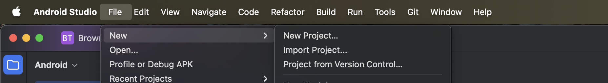
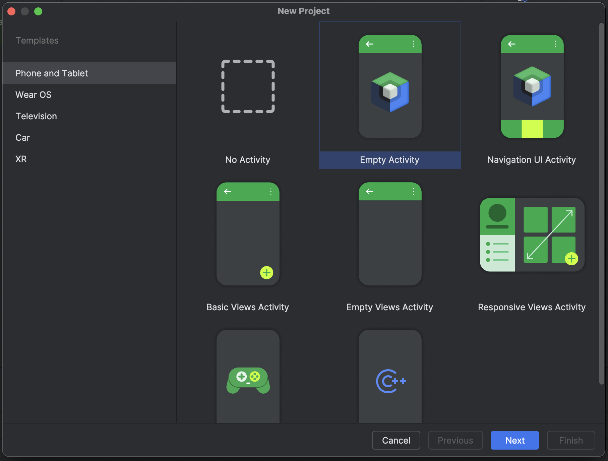
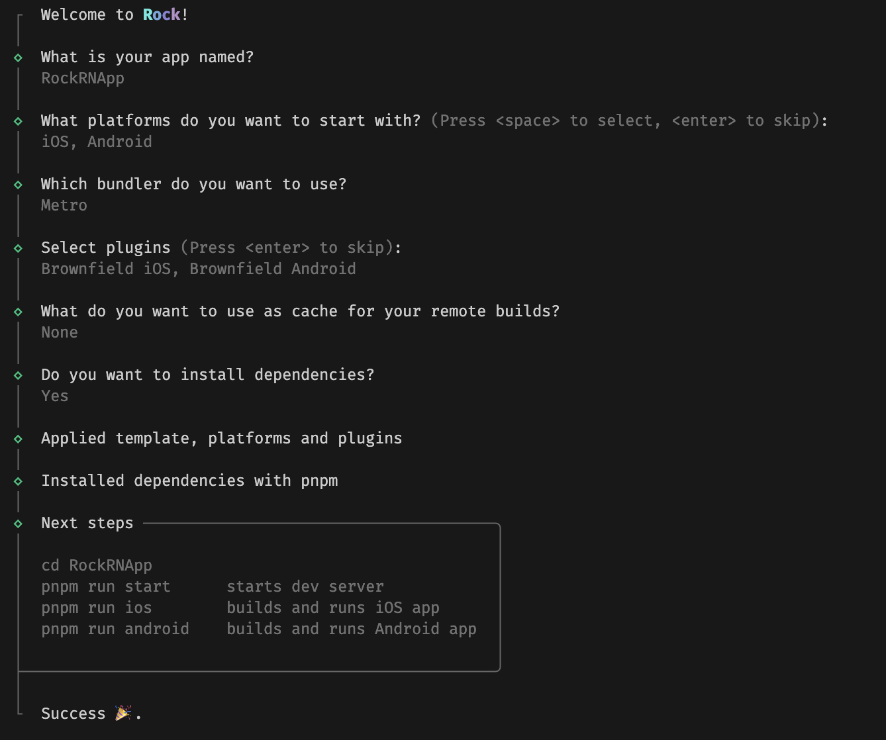
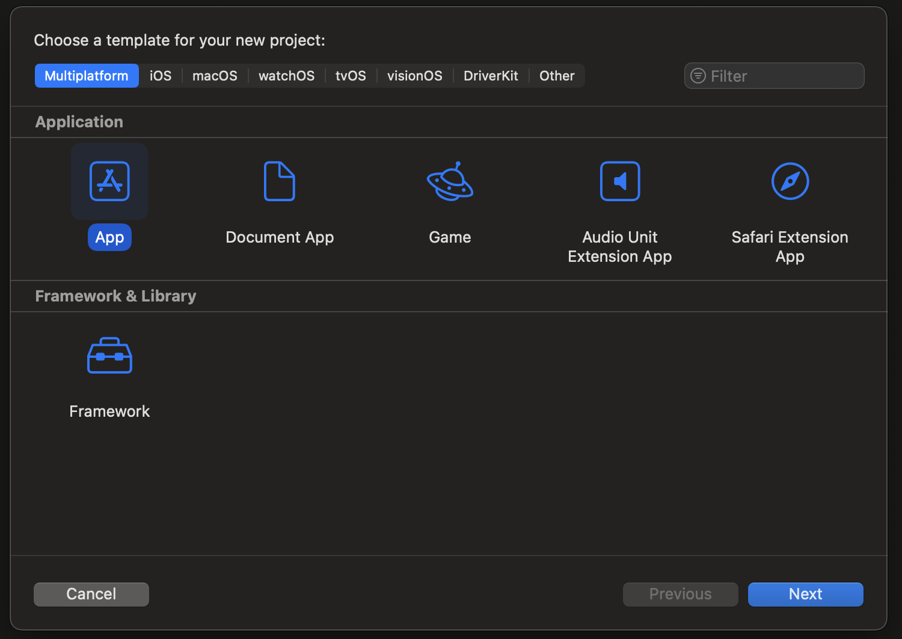
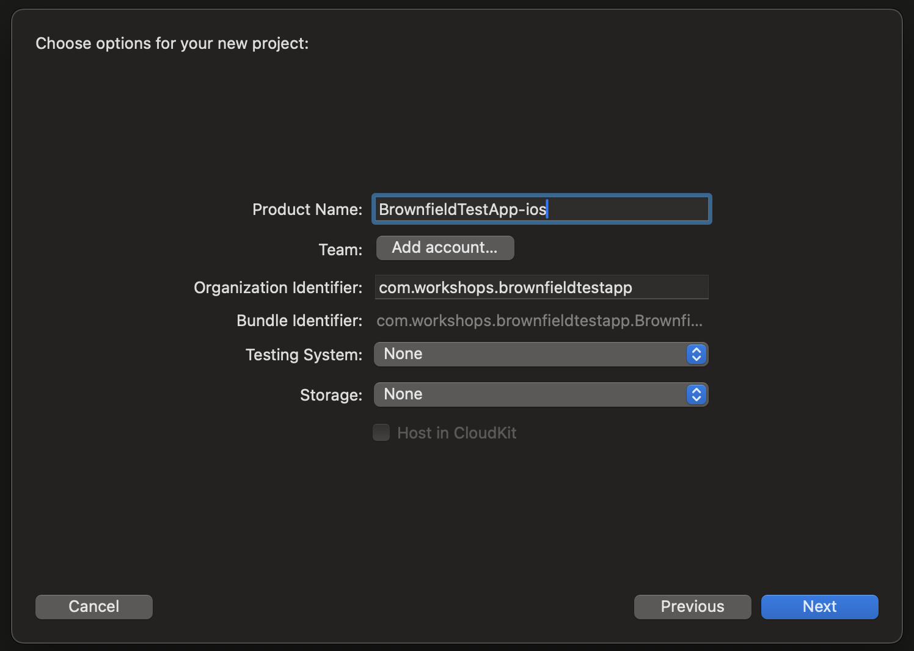
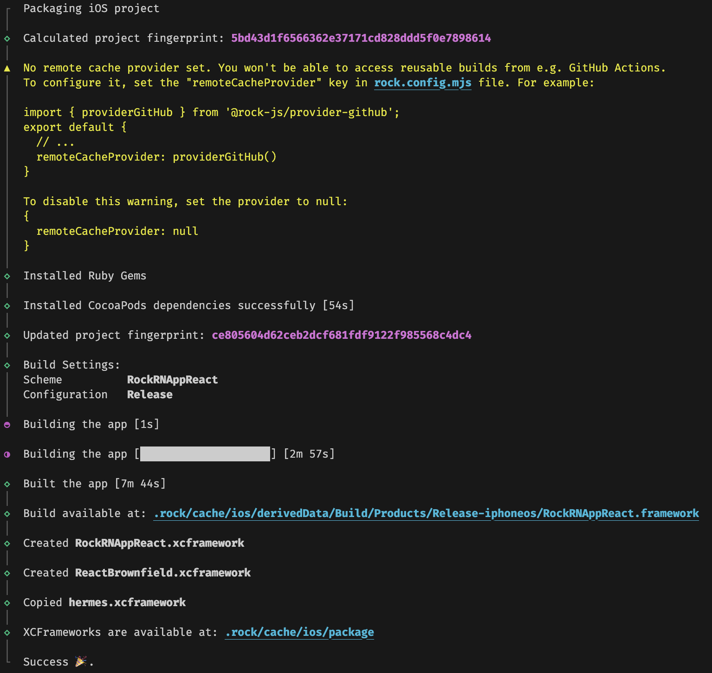
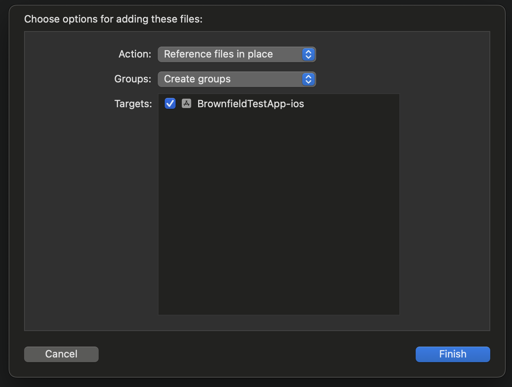
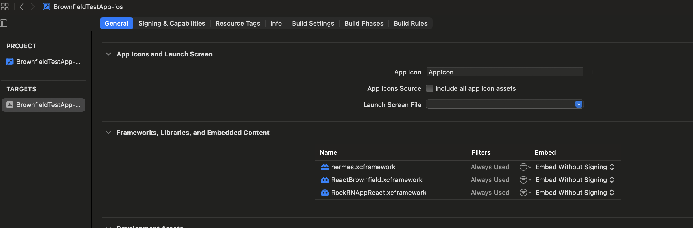

# React Native Android Brownfield with Rock

<p style="font-size: 1.4rem">Amazon Munich Workshops Nov. 2025</p>

---

## Setting up 'empty' projects

1. Create a new directory for the workshop and navigate into it
2. Run `git init` to initialize a git repository
3. Clone the Vega Sports App sample application:
   ```
   git submodule add https://github.com/AmazonAppDev/vega-sports-app.git
   ```
   which is the example Vega OS app which we'll share code from. This is a submodule, so you can update it with
   ```
   git submodule update
   ```
   _Unless you want to play with the Vega Sports App, you don't need to install its dependencies. The RockRnApp is configured in a way that it will use the dependencies from the Vega Sports App as its own dependencies._
4. Create empty activity from the "Phone and Tablet" app template in Android Studio and name it `BrownfieldTestApp-android`, with `com.workshops.brownfieldtestapp` as the package name and `BrownfieldTestApp-android` as save location.

   
   

5. In the project root run `npm create rock@latest` to create a new React Native mobile app using Rock framework. In our case we'll name it `RockRNApp`. Make sure to pick "Brownfield Android" (and "Brownfield iOS" if you want to support iOS) when asked to select plugins.

   

   Make sure to install dependencies (if you opted out during initialization of Rock framework):

   ```
   npm install
   ```

## Enable code sharing between Vega Sports App and Rock React Native mobile app

1. Copy the polyfills from [the GitHub repo](https://github.com/callstackincubator/amzn-workshops-2025-munich-poc/tree/solution/RockRNApp/polyfills) to a new `RockRNApp/polyfills/` directory
2. Import & create React Navigation navigator in `RockRNApp/App.tsx`:

   ```tsx
   import { NavigationContainer } from '@react-navigation/native';
   import { createNativeStackNavigator } from '@react-navigation/native-stack';

   const Stack = createNativeStackNavigator();
   ```

3. Import shared code from Vega Sports App in `RockRNApp/App.tsx`:

   ```tsx
   // vega-sports-app imports
   import { TranslationProvider } from '@AppServices/i18n';
   import { useAuth } from '@AppServices/auth';

   import { ROUTES } from '@AppSrc/navigators/constants';

   import { Login } from '@AppScreens/Login';
   import { SelectUserProfile } from '@AppScreens/SelectUserProfile';
   import { SettingsStack } from '@AppScreens/Settings/SettingsStack';
   ```

4. Create `RockRNApp/HomeScreen.tsx` with the following contents:

   ```tsx
   import { ScrollView, View, TouchableOpacity, Text } from 'react-native';
   import { useNavigation } from '@react-navigation/native';

   export function HomeScreen() {
     const { navigate } = useNavigation();

     return (
       <ScrollView style={{ flex: 1, flexDirection: 'column' }}>
         <TouchableOpacity
           style={{
             backgroundColor: '#7837F5',
             position: 'absolute',
             top: 10,
             right: 10,
             zIndex: 1,
             borderRadius: 8,
             padding: 10,
             height: 65,
             justifyContent: 'center',
             alignItems: 'center',
             alignContent: 'center',
           }}
           onPress={() => navigate('Settings')}
         >
           <Text
             style={{
               color: 'white',
               fontSize: 30,
               textAlign: 'center',
             }}
           >
             ⚙️ Settings
           </Text>
         </TouchableOpacity>
       </ScrollView>
     );
   }
   ```

   This component will serve as a demonstrator for placing our custom screen in the middle of a user flow imported from `vega-sports-app`.

5. Update `RockRNApp/App.tsx` to use the shared code and the new `HomeScreen`:

   ```tsx
   // Rock app imports
   import { HomeScreen } from './HomeScreen';
   import { SafeAreaView, SafeAreaProvider } from 'react-native-safe-area-context';

   export default function App() {
     const { isSignedIn } = useAuth();

     return (
       <SafeAreaProvider>
        <TranslationProvider>
          <SafeAreaView style={{ flex: 1, backgroundColor: 'black' }}>
            <NavigationContainer>
              {isSignedIn ? (
                <Stack.Navigator
                  initialRouteName={ROUTES.SelectUserProfile}
                  // below: since we don't mount all original screens, part of the app is missing and the missing navigator is mocked below
                  UNSTABLE_router={original => ({
                    getStateForAction(state, action, options) {
                      if (action.type === 'OPEN_DRAWER') {
                        // instead of opening the non-existent sidebar (drawer), just pop the current screen off the stack
                        return {
                          ...state,
                          routes: [...state.routes].slice(0, -1),
                          index: state.index - 1,
                        };
                      }

                      return original.getStateForAction(state, action, options);
                    },
                  })}
                  screenOptions={{
                    headerShown: false,
                  }}
                >
                  <Stack.Screen name="Home" component={HomeScreen} />

                  <Stack.Screen
                    name={ROUTES.Settings}
                    component={SettingsStack}
                  />
                  <Stack.Screen name={ROUTES.Drawer} component={HomeScreen} />

                  <Stack.Screen
                    name={ROUTES.SelectUserProfile}
                    component={SelectUserProfile}
                  />
                </Stack.Navigator>
              ) : (
                <Login />
              )}
            </NavigationContainer>
          </SafeAreaView>
        </TranslationProvider>
      </SafeAreaProvider>
     );
   }
   ```

6. Append Babel configuration for aliases of Vega Sports App code to be able to resolve aliases. This is specific to this exact project and is a mechanism developers may use, but it is not necessary for any setup:

   ```tsx
   module.exports = {
     // ...
     plugins: [
       'react-native-worklets/plugin',
       [
         'module-resolver',
         {
           extensions: ['.js', '.jsx', '.ts', '.tsx'],
           root: ['../vega-sports-app/'],
           alias: {
             '@Api': '../vega-sports-app/src/api',
             '@AppAssets': '../vega-sports-app/src/assets',
             '@AppComponents': '../vega-sports-app/src/components',
             '@AppScreens': '../vega-sports-app/src/screens',
             '@AppServices': '../vega-sports-app/src/services',
             '@AppUtils': '../vega-sports-app/src/utils',
             '@AppTestUtils': '../vega-sports-app/src/test-utils',
             '@AppTheme': '../vega-sports-app/src/theme',
             '@AppStore': '../vega-sports-app/src/store',
             '@AppModels': '../vega-sports-app/src/models',
             '@AppSrc': '../vega-sports-app/src',
             '@AppRoot': '../vega-sports-app/',
           },
         },
       ],
     ],
   };
   ```

7. Update `RockRNApp/metro.config.js` to match the below contents:

   ```javascript
   const {
     getDefaultConfig,
     mergeConfig,
   } = require('@react-native/metro-config');
   const path = require('path');
   const fs = require('fs');

   const polyfills = fs
     .readdirSync(path.join(__dirname, 'polyfills'), { withFileTypes: true })
     .map((file) =>
       file.isDirectory()
         ? {
             name: file.name,
             path: `${file.name}/index`,
           }
         : {
             name: file.name.replace(/\.[jt]sx?$/i, ''),
             path: file.name,
           }
     );

   console.log('Polyfills:', polyfills);

   const vegaSportsAppPath = path.resolve(__dirname, '../vega-sports-app');
   const aliases = {
     '@Api': path.join(vegaSportsAppPath, 'src/api/'),
     '@AppAssets': path.join(vegaSportsAppPath, 'src/assets/'),
     '@AppComponents': path.join(vegaSportsAppPath, 'src/components/'),
     '@AppScreens': path.join(vegaSportsAppPath, 'src/screens/'),
     '@AppServices': path.join(vegaSportsAppPath, 'src/services/'),
     '@AppUtils': path.join(vegaSportsAppPath, 'src/utils/'),
     '@AppTestUtils': path.join(vegaSportsAppPath, 'src/test-utils/'),
     '@AppTheme': path.join(vegaSportsAppPath, 'src/theme/'),
     '@AppStore': path.join(vegaSportsAppPath, 'src/store/'),
     '@AppModels': path.join(vegaSportsAppPath, 'src/models/'),
     '@AppSrc': path.join(vegaSportsAppPath, 'src/'),
     '@AppRoot': vegaSportsAppPath,
   };

   const selfNodeModulesPath = path.resolve(__dirname, 'node_modules');

   /**
    * Metro configuration
    * https://reactnative.dev/docs/metro
    *
    * @type {import('@react-native/metro-config').MetroConfig}
    */
   const config = {
     watchFolders: [path.resolve(vegaSportsAppPath)],
     resolver: {
       nodeModulesPaths: [selfNodeModulesPath],
       extraNodeModules: aliases,
       resolveRequest: function resolveRequest(context, moduleName, platform) {
         const absoluteOriginModulePath = path.resolve(
           context.originModulePath,
           moduleName
         );

         if (absoluteOriginModulePath.includes(vegaSportsAppPath)) {
           // override @amazon-devices scoped packages to non-amazon ones
           if (moduleName.includes('@amazon-devices')) {
             let newModuleName;

             if (moduleName.includes('__')) {
               // convert paths like @amazon-devices/react-navigation__core -> @react-navigation/core etc.
               const parts = moduleName.split('/');
               const scopedPackage = parts[1]; // e.g. react-navigation__core
               const [prefix, rest] = scopedPackage.split('__');

               newModuleName = `@${prefix}/${rest}`;
             } else {
               // convert scoped packages: @amazon-devices/... -> ...
               newModuleName = moduleName.replace('@amazon-devices/', '');
             }

             // check for Amazon package custom renames
             switch (newModuleName) {
               case 'react-linear-gradient':
                 newModuleName = 'react-native-linear-gradient';
                 break;
             }

             console.log(`${moduleName} mapped to ${newModuleName}`);
             moduleName = newModuleName;
           }

           // check for polyfills
           const maybePolyfillPath = polyfills.find(
             (polyfill) => polyfill.name === moduleName
           );
           if (maybePolyfillPath) {
             const polyfillFullPath = path.join(
               __dirname,
               'polyfills',
               maybePolyfillPath.path
             );

             console.log(
               `${moduleName} resolved to polyfill at ${polyfillFullPath}`
             );

             return {
               type: 'sourceFile',
               filePath: polyfillFullPath,
             };
           }
         }

         // fallback to default Metro resolver
         return context.resolveRequest(context, moduleName, platform);
       },
     },
   };

   module.exports = mergeConfig(getDefaultConfig(__dirname), config);
   ```

8. Add the following `dependencies` to `RockRNApp/package.json` that are required for the Vega Sports App:

   ```json
   "@react-navigation/drawer": "^7.7.1",
   "@react-navigation/native": "^7.1.19",
   "@react-navigation/native-stack": "^7.6.1",
   "@react-navigation/stack": "^7.6.1",
   "@tanstack/react-query": "~5.90.0",
   "email-validator": "^2.0.4",
   "date-fns": "^4.1.0",
   "lodash": "^4.17.21",
   "lodash.get": "^4.4.2",
   "react-native-device-info": "^14.1.1",
   "react-native-gesture-handler": "^2.29.0",
   "react-native-linear-gradient": "^2.8.3",
   "react-native-safe-area-context": "^5.6.2",
   "react-native-screens": "^4.18.0",
   "react-native-vector-icons": "^10.3.0",
   "zustand": "^5.0.8"
   ```

   In your project, you should strive for these versions to be the same. Sometimes, however, like in the case of `@tanstack/react-query`, you may need to use a different version due to React compatibility. Let's remember that VegaOS project is on React 18.2 and we're using React 19.1 in our RockRNApp project.

   **This means, that effectively your shared dependencies should be compatible with both React 18 and 19.**

9. Add the following `devDependencies` to `RockRNApp/package.json`:

   ```json
   "@types/lodash": "^4.17.20",
   "babel-plugin-module-resolver": "^5.0.2"
   ```

10. Run `npm install` inside `RockRNApp` to install the new dependencies.

11. Normally, you would configure a separate, secure keystore for release signing. For demonstration needs of this workshops, we will use the debug keystore for release - adjust the `RockRNApp/android/app/build.gradle` file accordingly:

    ```gradle
    buildTypes {
        debug {
            signingConfig signingConfigs.debug
        }
        release {
            // Caution! In production, you need to generate your own keystore file.
            // see https://reactnative.dev/docs/signed-apk-android.
            // signingConfig signingConfigs.release
            minifyEnabled enableProguardInReleaseBuilds
            proguardFiles getDefaultProguardFile("proguard-android.txt"), "proguard-rules.pro"
            signingConfig = signingConfigs.getByName("debug")
        }
    }
    ```

12. In the RockRNApp project you can now package an AAR for Android & publish to Maven local from `RockRNApp/`:
    ```sh
    npm run publish-local:aar
    ```
    Verify the artifact has been published:
    ```sh
    ls ~/.m2/repository/com/rockrnappreact/rockrnapp
    ```

13. (Optional) Prepare the iOS artifact from `RockRNApp/`:
    ```sh
    cd ios
    pod install
    cd ..
    npm run package:ios
    ```

14. (Optional) You can run the Rock React Native app standalone on Android or iOS to verify it works:
    ```sh
    adb reverse tcp:8081 tcp:8081
    npm run android
    ```
    
    or for iOS:
    
    ```sh
    npm run ios -- --no-install-pods
    ```

## Brownfield Android app

Now, we will follow the [Brownfield Android documentation](https://www.rockjs.dev/docs/brownfield/android) for Rock framework to integrate our React Native app into native Android app. For demonstration purposes of this workshop, we will set up an Android mobile application that will run on TV devices as well with minor adjustments. Normally, other solutions would be needed, such as adding another flavor using full-fledged TV APIs.

1. First, we need to add dependencies for embedding our React Native app into the Android project to `BrownfieldTestApp-android/app/build.gradle.kts`:

   ```kotlin
   implementation("com.google.android.material:material:1.9.0")
   implementation("androidx.fragment:fragment-compose:1.8.9")
   implementation("com.rockrnappreact:rockrnapp:0.0.1-local")
   implementation("androidx.appcompat:appcompat:1.7.1")
   ```

2. For Gradle to be able to find our locally-published Rock RN artifact, we need to add `mavenLocal()` to the list of repositories in `BrownfieldTestApp-android/settings.gradle.kts`:

   ```kotlin
   dependencyResolutionManagement {
       repositoriesMode.set(RepositoriesMode.FAIL_ON_PROJECT_REPOS)
       repositories {
           mavenLocal() // <-- to be added
           google()
           mavenCentral()
       }
       // ...
   ```

3. Since our artifact normally - during development - would be published relatively frequently, for Gradle not to cache and reuse the same old artifact, we need to append the following to `BrownfieldTestApp-android/app/build.gradle.kts` file:

   ```kotlin
   configurations.all {
       resolutionStrategy {
           // force Gradle to always check for new versions of changing modules
           cacheChangingModulesFor(0, "seconds")
           cacheDynamicVersionsFor(0, "seconds")
       }
   }
   ```

4. In development mode, any React Native application utilizes the Metro bundler to obtain the bundle. Since this is non-encrypted communication over the internet, we need a permission for internet access and for cleartext traffic in `BrownfieldTestApp-android/app/src/main/AndroidManifest.xml`:

   ```xml
   <uses-permission android:name="android.permission.INTERNET" />

   <application
       android:usesCleartextTraffic="true"
       ...
   >
   ```

5. Modify `MainActivity.kt` to leverage an example Jetpack Compose UI and include a conditionally-rendered React Native screen. Below, we show you the simplest way in which you can embed your React Native app inside a Jetpack Compose UI. Please read through it, below it, there is a ready-to-use complex Compose UI with React Native embedded, which you can copy over.

   Firstly, change the default `ComponentActivity` base class of `MainActivity` to be `AppCompatActivity`. React Native itself requires the activity to be a subclass of `FragmentActivity`, but the used `react-native-screens` library requires it to be `AppCompatActivity` (which itself [is a subclass of](https://developer.android.com/reference/androidx/appcompat/app/AppCompatActivity) `FragmentActivity`).

   Secondly, initialize React Native in the `onCreate` method using `ReactNativeHostManager.initialize()` that comes from React Native Brownfield library bundled with our AAR artifact:

   ```kotlin
   override fun onCreate(savedInstanceState: Bundle?) {
       super.onCreate(savedInstanceState)

       // Initialize React Native
       ReactNativeHostManager.initialize(this.application) {
           println("JS bundle loaded")
       }
       // ...
   }
   ```

   Then, use the `AndroidFragment` composable from React Native Brownfield library to render a full size React Native screen wherever you feel like in your UI:

   ```kotlin
   AndroidFragment<ReactNativeFragment>(
       arguments = Bundle().apply {
           putString(ReactNativeFragmentArgNames.ARG_MODULE_NAME, "RockRNApp")
       }, modifier = Modifier
           .fillMaxSize()
   )
   ```

> [!TIP]
> Below, you can find a ready-to-use, complex UI which is recommended for this workshop. If you don't want to use it, you can implement it yourself based on the instructions above.

   <details>
   <summary>Full MainActivity.kt file with Ready-to-use Compose UI</summary>

   ```kotlin
   package com.workshops.brownfieldtestapp
   import android.os.Bundle
   import android.widget.Toast
   import androidx.activity.compose.BackHandler
   import androidx.activity.compose.setContent
   import androidx.appcompat.app.AppCompatActivity
   import androidx.compose.animation.animateContentSize
   import androidx.compose.animation.core.FastOutSlowInEasing
   import androidx.compose.animation.core.animateDpAsState
   import androidx.compose.animation.core.tween
   import androidx.compose.foundation.background
   import androidx.compose.foundation.horizontalScroll
   import androidx.compose.foundation.layout.Arrangement
   import androidx.compose.foundation.layout.Box
   import androidx.compose.foundation.layout.Column
   import androidx.compose.foundation.layout.Row
   import androidx.compose.foundation.layout.fillMaxSize
   import androidx.compose.foundation.layout.fillMaxWidth
   import androidx.compose.foundation.layout.padding
   import androidx.compose.foundation.rememberScrollState
   import androidx.compose.material3.Button
   import androidx.compose.material3.ButtonDefaults
   import androidx.compose.material3.ExperimentalMaterial3Api
   import androidx.compose.material3.MaterialTheme
   import androidx.compose.material3.Surface
   import androidx.compose.material3.Switch
   import androidx.compose.material3.Text
   import androidx.compose.runtime.Composable
   import androidx.compose.runtime.getValue
   import androidx.compose.runtime.mutableStateOf
   import androidx.compose.runtime.remember
   import androidx.compose.runtime.setValue
   import androidx.compose.ui.Alignment
   import androidx.compose.ui.Modifier
   import androidx.compose.ui.graphics.Color
   import androidx.compose.ui.graphics.RectangleShape
   import androidx.compose.ui.platform.LocalContext
   import androidx.compose.ui.unit.dp
   import androidx.fragment.compose.AndroidFragment
   import com.callstack.reactnativebrownfield.ReactNativeFragment
   import com.callstack.reactnativebrownfield.constants.ReactNativeFragmentArgNames
   import com.rockrnappreact.ReactNativeHostManager
   import com.workshops.brownfieldtestapp.ui.theme.BrownfieldTestAppandroidTheme

   object Constants {
       val ReactNativeCategory = "React Native"

       val Categories = listOf(
           "Movies",
           "TV Shows",
           ReactNativeCategory,
           "Sports",
           "News"
       )

       val ReactNativeCategoryIndex = Categories.indexOf(ReactNativeCategory)
   }

   class MainActivity : AppCompatActivity() {
       @OptIn(ExperimentalMaterial3Api::class)
       override fun onCreate(savedInstanceState: Bundle?) {
           super.onCreate(savedInstanceState)

           // Initialize React Native
           ReactNativeHostManager.initialize(this.application) {
               println("JS bundle loaded")
           }

           setContent {
               BrownfieldTestAppandroidTheme(darkTheme = true) {
                   Surface(
                       modifier = Modifier.fillMaxSize(),
                       shape = RectangleShape
                   ) {
                       MainScreen()
                   }
               }
           }
       }
   }

   @Composable
   fun MainScreen() {
       val context = LocalContext.current
       var selectedCategory by remember { mutableStateOf(0) }
       var isSettingsEnabled by remember { mutableStateOf(false) }

       val showReactNative = selectedCategory == Constants.ReactNativeCategoryIndex

       BackHandler(enabled = selectedCategory > 0) {
           Toast.makeText(context, "Native - returning home", Toast.LENGTH_SHORT)
               .show()
           selectedCategory = 0
       }

       val rootContentPadding by animateDpAsState(
           targetValue = if (showReactNative) 4.dp else 32.dp,
           label = "paddingAnim",
           animationSpec = tween(
               durationMillis = 800,
               easing = FastOutSlowInEasing
           ),
       )

       Column(
           modifier = Modifier
               .fillMaxSize()
               .padding(rootContentPadding)
               .animateContentSize()
       ) {
           if (!showReactNative) {
               // Title
               Text(
                   text = "Android TV Demo",
                   style = MaterialTheme.typography.headlineLarge,
                   modifier = Modifier.padding(bottom = 24.dp),
               )
           }

           // Categories
           Row(
               modifier = Modifier.padding(bottom=24.dp).horizontalScroll(rememberScrollState()),
               horizontalArrangement = Arrangement.spacedBy(16.dp),
           ) {
               Constants.Categories.forEachIndexed { index, category ->
                   val active = selectedCategory == index

                   Button(
                       onClick = { selectedCategory = index },
                       colors = ButtonDefaults.buttonColors(
                           containerColor = if (active)
                               MaterialTheme.colorScheme.primary
                           else
                               MaterialTheme.colorScheme.surface
                       )
                   ) {
                       Text(
                           category,
                           color = if (active) MaterialTheme.colorScheme.onPrimary else MaterialTheme.colorScheme.onSurface
                       )
                   }
               }
           }

           if (!showReactNative) {
               // Settings Toggle
               Row(
                   modifier = Modifier.padding(bottom = 24.dp),
                   verticalAlignment = Alignment.CenterVertically
               ) {
                   Switch(
                       checked = isSettingsEnabled,
                       onCheckedChange = { isSettingsEnabled = it },
                       modifier = Modifier.padding(end = 16.dp)
                   )
                   Text(
                       text = if (isSettingsEnabled) "Settings Enabled" else "Settings Disabled",
                       style = MaterialTheme.typography.bodyLarge
                   )
               }
           }

           // Content Preview
           Box(
               modifier = Modifier
                   .fillMaxWidth()
                   .weight(1f)
                   .padding(top = if (showReactNative) 0.dp else 24.dp)
           ) {
               if (showReactNative) {
                   AndroidFragment<ReactNativeFragment>(
                       arguments = Bundle().apply {
                           putString(ReactNativeFragmentArgNames.ARG_MODULE_NAME, "RockRNApp")
                       }, modifier = Modifier
                           .fillMaxSize()
                   )
               } else {
                   Text(
                       text = "Currently selected: ${
                           Constants.Categories[selectedCategory]
                       } ${if (isSettingsEnabled) "(Settings Enabled)" else ""}",
                       style = MaterialTheme.typography.bodyLarge,
                       modifier = Modifier.align(Alignment.Center)
                   )
               }
           }
       }
   }
   ```

   </details>
   <br />

6. Inside the `AndroidManifest.xml`'s `intent-filter`, add the Leanback launcher category to be able to launch the app on TV devices:

   ```xml
   <intent-filter>
       <action android:name="android.intent.action.MAIN" />

       <category android:name="android.intent.category.LAUNCHER" />
       <category android:name="android.intent.category.LEANBACK_LAUNCHER" /> <!-- to be added -->
   </intent-filter>
   ```

7. Inside the `AndroidManifest.xml`, append two `uses-feature` tags in the root scope (below `uses-permission`):

   ```xml
   <uses-feature
   android:name="android.hardware.touchscreen"
   android:required="false" />
   <uses-feature
       android:name="android.software.leanback"
       android:required="false" />
   ```

8. React Native requires that the host app's theme is `AppCompat` or a descendant thereof, thus, modify `app/src/main/res/values/themes.xml` and update the existing style tag to have the `parent` attribute set to `Theme.AppCompat.DayNight.NoActionBar`.

9.  Now, you're ready to run the app on your native Android device or emulator through Android Studio.

   8.1. If you run in debug mode, the React Native app will expect a dev server (Metro) running to serve our JavaScript code. You can start it by running this in the `RockRNApp` project directory:

   ```sh
   npm start
   ```

   and also will require you to forward port `8081`:
   ```sh
   adb reverse tcp:8081 tcp:8081
   ```

   8.2. If you run in release mode, there's nothing you need to do. The app will automatically use the pre-built JavaScript bundle that we fetch from local Maven repository.

# React Native iOS Brownfield (optional)

## Setting up 'empty' project

First, bootstrap an empty iOS project:



## Brownfield iOS app

1. Package the RockRNApp project as an XCFramework:
  ```sh
  npm run package:ios
  ```

  Build may take a few minutes for the first time. Afterwards, you will see the following:
  

2. Run `open .rock/cache/ios/package` & drag-and-drop all 3 files: `hermes.xcframework`, `ReactBrownfield.xcframework` and `RockRNAppReact.xcframework` to XCode. You can select "Reference files in place" when prompted so as not to have to copy the XCFramework files every time you re-package them.
   

  Ensure the frameworks are embedded in your app:

  

3. Inside `BrownfieldTestApp-ios/BrownfieldTestApp-ios/BrownfieldTestApp_iosApp.swift`, initialize RN Brownfield:

  ```swift
  import SwiftUI
  import ReactBrownfield // import RN Brownfield
  import RockRNAppReact // this import contains ReactNativeBundle

  @main
  struct BrownfieldTestApp_iosApp: App {
      // add the init method below
      init() {
          ReactNativeBrownfield.shared.bundle = ReactNativeBundle
          ReactNativeBrownfield.shared.startReactNative {
              print("React Native bundle loaded")
          }
      }

      var body: some Scene {
          WindowGroup {
              ContentView()
          }
      }
  }
  ```
4. Replace `BrownfieldTestApp-ios/BrownfieldTestApp-ios/ContentView.swift` with the following code to render a React Native screen inside SwiftUI:

  ```swift
  import ReactBrownfield
  import SwiftUI

  struct Constants {
      static let reactNativeCategory = "React Native"
      static let categories = [
          "Movies",
          "TV Shows",
          reactNativeCategory,
          "Sports",
          "News",
      ]
      static let reactNativeCategoryIndex =
          categories.firstIndex(of: reactNativeCategory) ?? 0
  }

  struct ContentView: View {
      @State private var selectedCategory = 0
      @State private var isSettingsEnabled = false
      @Namespace private var animation

      var showReactNative: Bool {
          selectedCategory == Constants.reactNativeCategoryIndex
      }

      @Environment(\.dismiss) private var dismiss

      var body: some View {
          NavigationStack {
              VStack(alignment: .leading, spacing: 24) {
                  if !showReactNative {
                      Text("iOS SwiftUI Demo")
                          .font(.largeTitle)
                          .bold()
                  }

                  // Categories Row
                  ScrollView(.horizontal, showsIndicators: false) {
                      HStack(spacing: 16) {
                          ForEach(Constants.categories.indices, id: \.self) {
                              index in
                              let category = Constants.categories[index]
                              Button(action: {
                                  withAnimation(.easeInOut(duration: 0.3)) {
                                      selectedCategory = index
                                  }
                              }) {
                                  Text(category)
                                      .padding(.horizontal, 16)
                                      .padding(.vertical, 8)
                                      .background(
                                          RoundedRectangle(cornerRadius: 8)
                                              .fill(
                                                  selectedCategory == index
                                                      ? Color.accentColor
                                                      : Color(.systemGray5)
                                              )
                                      )
                                      .foregroundColor(
                                          selectedCategory == index
                                              ? .white : .primary
                                      )
                              }
                          }
                      }
                  }

                  if !showReactNative {
                      // Settings Toggle
                      Toggle(isOn: $isSettingsEnabled.animation(.easeInOut)) {
                          Text(
                              isSettingsEnabled
                                  ? "Settings Enabled" : "Settings Disabled"
                          )
                          .font(.body)
                      }
                      .toggleStyle(SwitchToggleStyle(tint: .accentColor))
                  }

                  // Content Area
                  ZStack {
                      if showReactNative {
                          // React Native View
                          ReactNativeView(moduleName: "RockRNApp")
                              .navigationBarHidden(true)
                      } else {
                          Text(
                              "Currently selected: \(Constants.categories[selectedCategory]) \(isSettingsEnabled ? "(Settings Enabled)" : "")"
                          )
                          .font(.body)
                          .frame(maxWidth: .infinity, maxHeight: .infinity)
                          .multilineTextAlignment(.center)
                          .padding()
                      }
                  }
                  .frame(maxWidth: .infinity, maxHeight: .infinity)
                  .background(Color(.secondarySystemBackground))
                  .cornerRadius(16)
                  .animation(.easeInOut(duration: 0.3), value: showReactNative)
              }
              .padding(showReactNative ? 4 : 32)
              .animation(.easeInOut(duration: 0.8), value: showReactNative)
              .navigationTitle("Main Screen")
              .toolbar {
                  // Simulate BackHandler (only active when not home)
                  if selectedCategory > 0 {
                      Button("Back") {
                          withAnimation {
                              selectedCategory = 0
                          }
                      }
                  }
              }
          }
          .toolbar {
              ToolbarItem(placement: .navigationBarLeading) {
                  Button(action: { dismiss() }) {
                      Label("Back", systemImage: "chevron.left")
                          .labelStyle(.titleAndIcon)
                  }
              }
          }
      }
  }

  #Preview {
      ContentView()
  }
  ```
